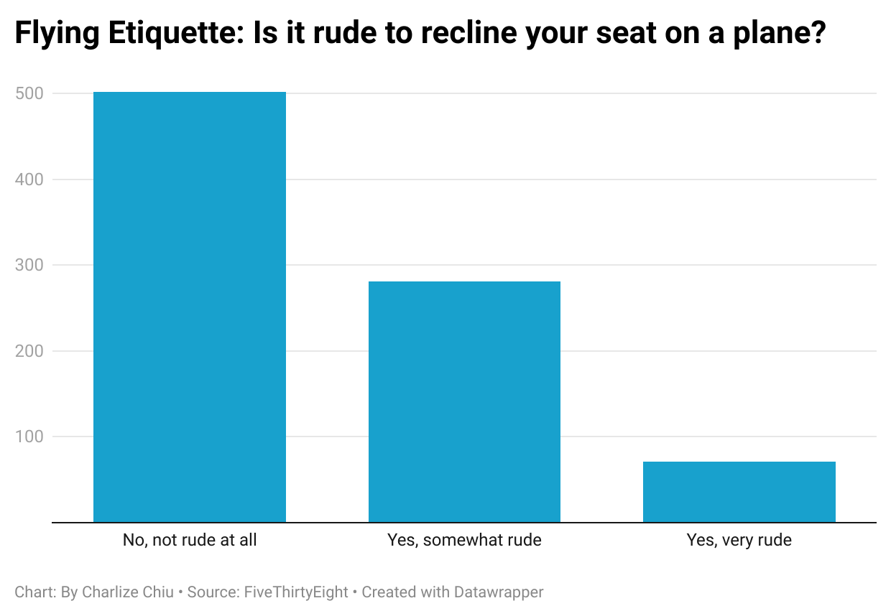

# Journ124
Journ 124 Summer 2024 - Week 4

**Question 6.5**
I picked the question "Is it rude to recline your seat on a plane?" because it was relatively straight to the point and had 3 simple answers: yes, no, or somewhat. I thought that these answers and the corresponding data would be easy to visualize and comprehend through a bar/column chart. The nature of this question doesn't allow for much complexity and there are probably more nuanced takes, which the rest of the dataset explores.

My chart shows that the majority of people believe that it's not rude at all to recline your seat on a plane, compared to the people who said "yes" or "somewhat" combined. Out of those who replied "yes", a majority agreed that it was only sometimes rude to recline your seat. Only a small proportion of people agreed that it was very rude to recline your seat.
